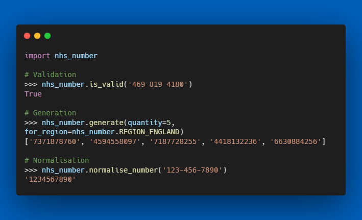

# nhs-number

<figure markdown>
  
  <figcaption>Validation, generation and normalisation of NHS Numbers</figcaption>
</figure>

A Python package to provide utilities for NHS Numbers, including validity checks, normalisation, and generation.

While validating an NHS Number is straightforward to achieve in code, it seems wasteful for developers to implement their own solutions. Further, many developers are likely unaware of the various rules and nuances of NHS/CHI/H&C Numbers across the UK Nations.

This package aims to provide a single, well-maintained, well-documented solution for all developers.

`nhs-number` is a collaboration between several individuals, groups and teams, each separately maintaining an NHS Number Python package. See [Contributors](./contributors.md) for more information.

## Features

- **Validation** of NHS Numbers using the check-digit algorithm.
- **Generation** of valid and invalid NHS Numbers for testing purposes, for any selected `Region`.
- **Normalisation** of NHS Numbers from various string formats to a standard 10-digit string format.
- Additional details and information on an NHS number, such as the region for which it's valid, and the reason for invalidity, if invalid.

--8<--
docs/_assets/_snippets/live-usage-warning.md
--8<--

--8<--
docs/_assets/_snippets/scottish-chi-number.md
--8<--

## Roadmap

- Additional validation for Scottish CHI numbers to ensure the first 6 digits are a valid `DDMMYY` Date of Birth.
- Generation of valid Scottish CHI numbers along the same rules.
- Validation and generation of [IHI Numbers for the Republic of Ireland](ihi-ireland.md), subject to contributors wanting to collaborate on this, and there being a demand for implementation.
